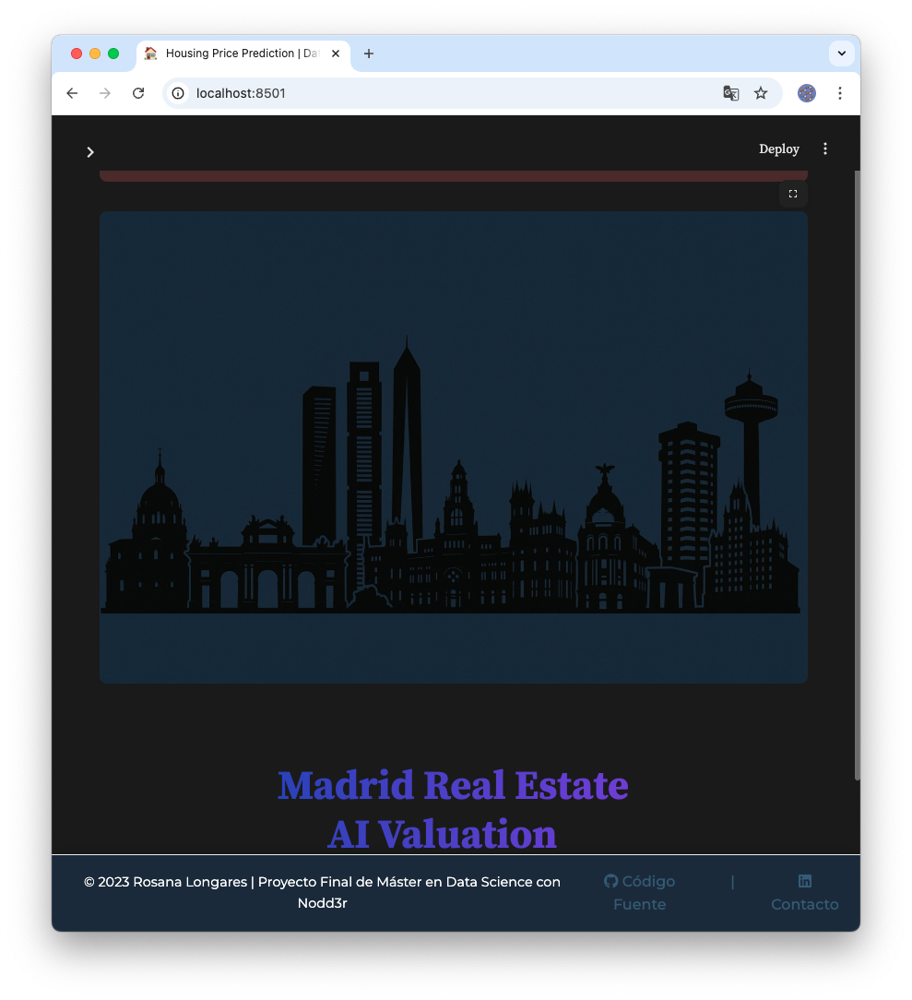
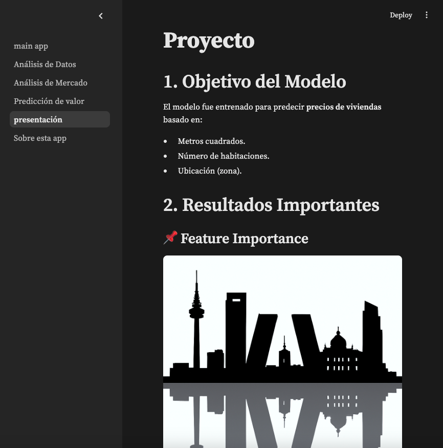

# 🏠 Madrid Real Estate Analytics Dashboard

  
*Dashboard interactivo del mercado inmobiliario de Madrid*

## 📌 Descripción

Aplicación Streamlit para análisis avanzado del mercado inmobiliario madrileño que incluye:
- 📊 Visualización interactiva de distribuciones de precios
- 📈 Evolución temporal de valores
- 🗺️ Comparativa geográfica entre distritos
- 📐 Relación precio/metros cuadrados
- 🔍 Modelo predictivo de valoración automática

## 🛠 Stack Tecnológico

| Categoría       | Tecnologías                                                                 |
|-----------------|-----------------------------------------------------------------------------|
| Frontend        |   |
| Backend         |       |
| Procesamiento   |   |
| Visualización   |   |
| Machine Learning|  |

## 🚀 Instalación y Ejecución

### Requisitos previos
```bash
# Clonar repositorio
git clone https://github.com/RosanaNicklas/Madrid_Real_Estate_AI_Valuation.git
cd Madrid_Real_Estate_AI_Valuation

# Crear entorno virtual (opcional pero recomendado)
python -m venv venv
source venv/bin/activate  # Linux/Mac
.\venv\Scripts\activate  # Windows

# Instalar dependencias
pip install -r requirements.txt


Ejecutar la aplicación
bash
streamlit run main_app.py
La aplicación estará disponible en: http://localhost:8501

                      🖼️ Galería de la Aplicación

                           Pantallas principales

    Inicio de sesión
 

    Dashboard principal


                              Análisis de datos

Distribuciones estadísticas


Precios por m²


Análisis de mercado

Estadísticas del mercado 1


Estadísticas del mercado 2


Funcionalidades avanzadas

Modelo de predicción


Mapa interactivo


Información

Sobre la app


Madrid_Real_Estate_AI_Valuation/
├── main_app.py              # Aplicación principal
├── pages/
│   ├── 1_📊_Análisis_de_Datos.py
│   ├── 2_📈_Análisis_de_Mercado.py
│   ├── 3_🔮_Predicción.py
│   └── 4_ℹ️_Sobre_la_App.py
├── assets/
│   ├── screenshots/         # Capturas de pantalla
│   └── Madrid_castizo.png   # Imágenes estáticas
├── data/                   # Datasets
├── models/                 # Modelos entrenados
└── requirements.txt        # Dependencias

✉️ Contacto

Rosana Longares

📧 rosana8longares@gmail.com

LinkedIn https://www.linkedin.com/in/rosanalongares/
GitHub  https://github.com/RosanaNicklas
