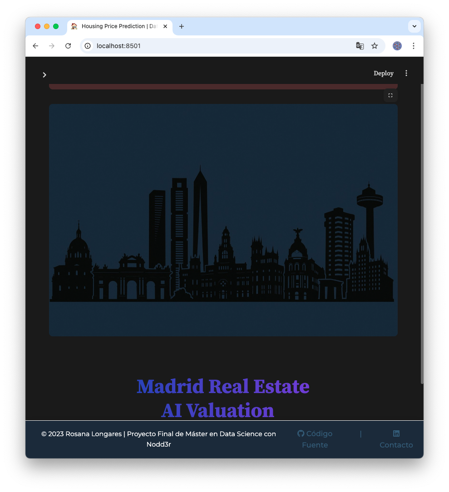
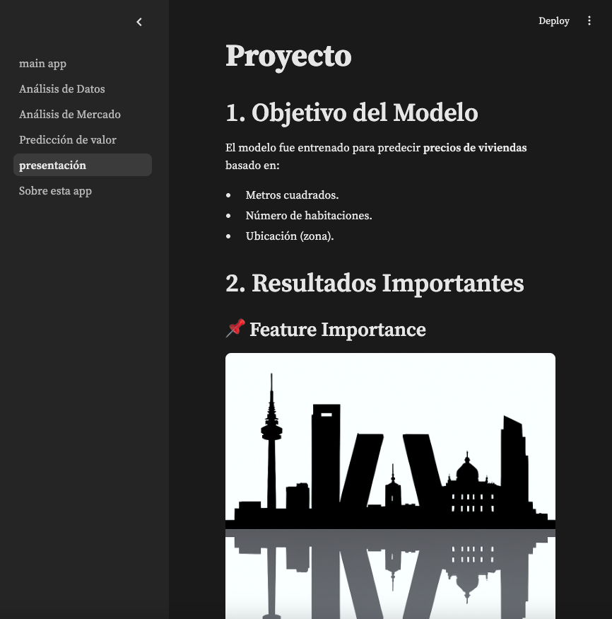
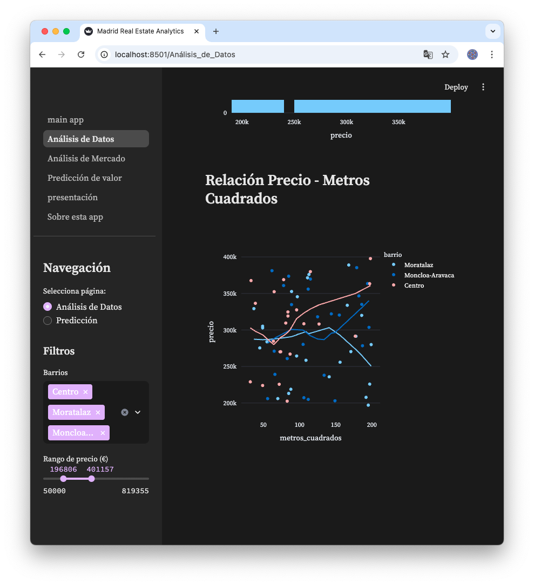
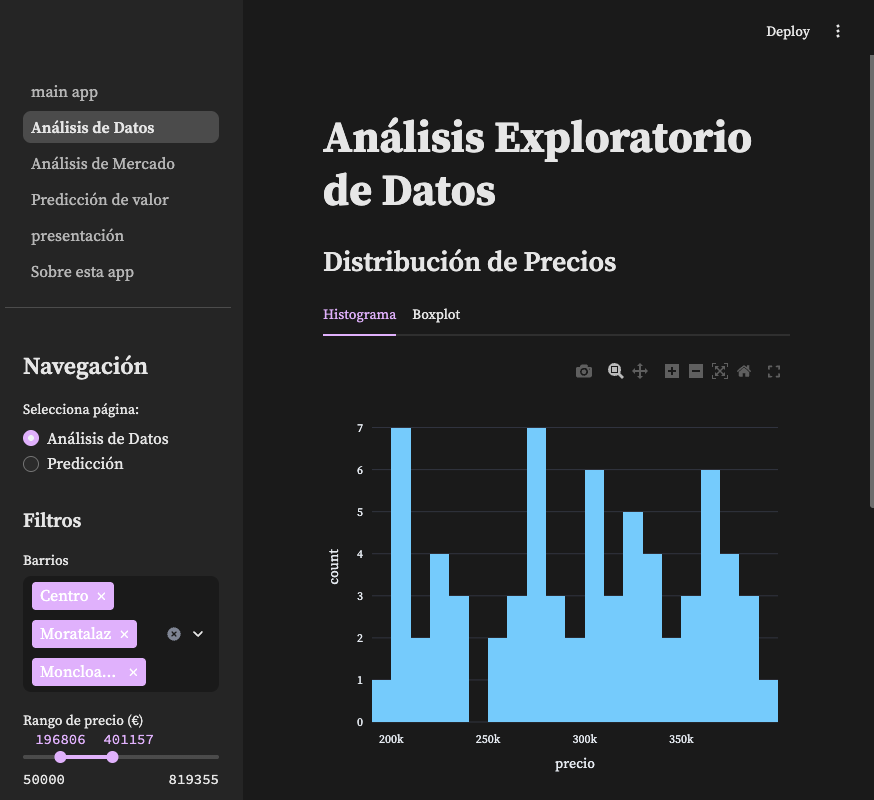
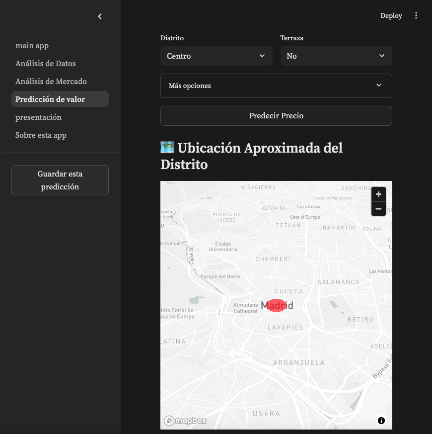
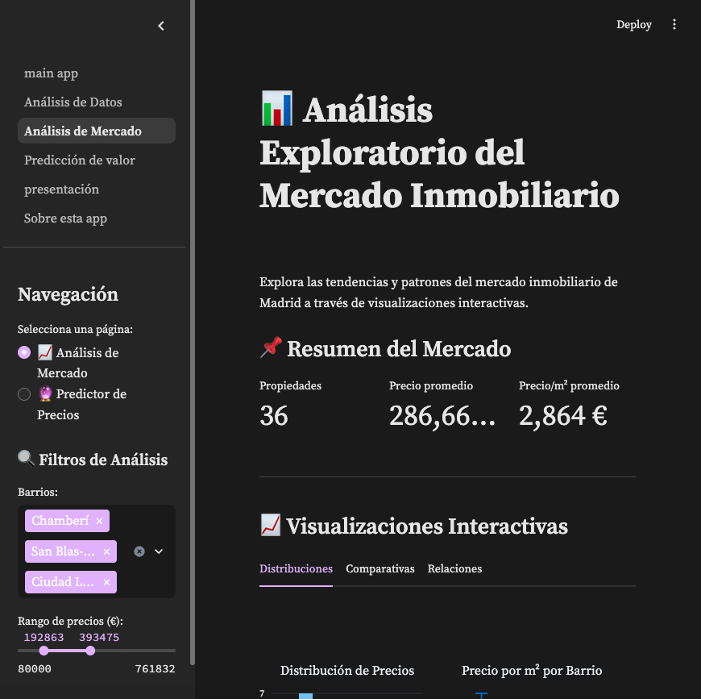
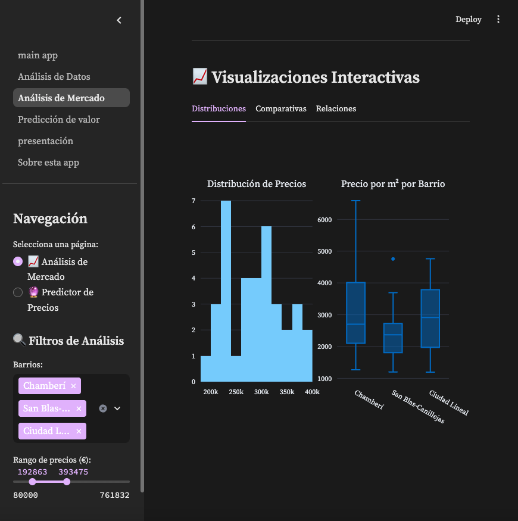
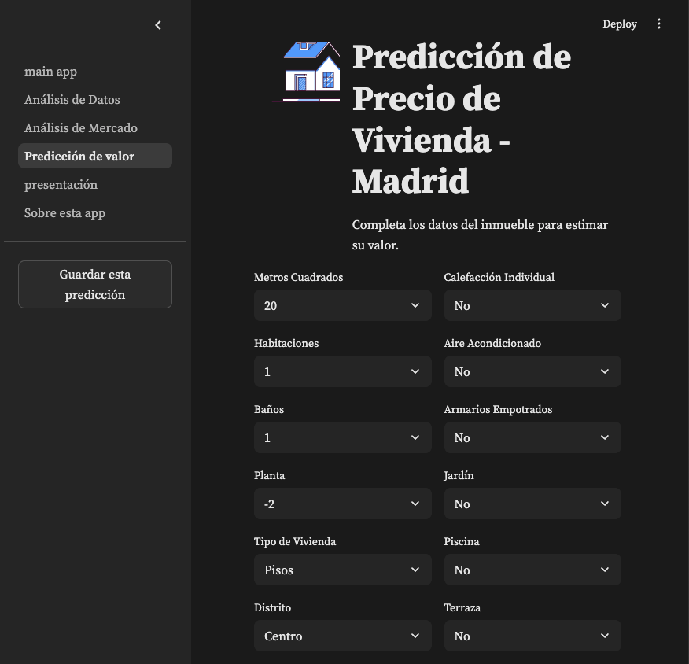
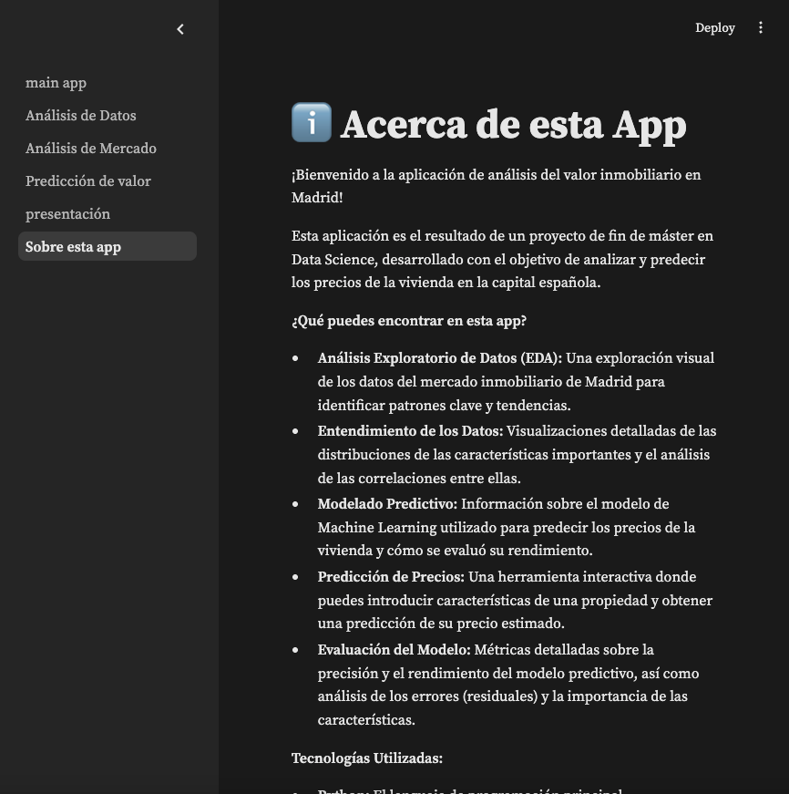

# 🏠 Dashboard Analítico de Mercado Inmobiliario de Madrid

  
*Dashboard interactivo para análisis del mercado inmobiliario madrileño*

## 🌟 Características Principales

<div align="center">
  
  
</div>
<div align="center">
  
  
</div>

## 🛠 Tecnologías Utilizadas

| Categoría       | Tecnologías                                                                 |
|-----------------|-----------------------------------------------------------------------------|
| Frontend        |   |
| Backend         |       |
| Visualización   |            |

## 📊 Módulos Destacados

### 1. Análisis Geográfico

*Visualización por distritos con filtros interactivos*
<div align="center">
  
  
</div>

### 2. Modelo Predictivo
```python
# Código de ejemplo del modelo
from sklearn.ensemble import RandomForestRegressor
model = RandomForestRegressor()
model.fit(X_train, y_train)

<div align="center">
  
  
</div>

3. Evolución Temporal
<div align="center">  </div>

🚀 Instalación

git clone https://github.com/RosanaNicklas/Madrid_Real_Estate_AI_Valuation.git
pip install -r requirements.txt
streamlit run main_app.py

📱 Capturas Adicionales
Sección	Vista
Login	
Predicción	
Acerca de	

<div align="center">
  
  
</div>
✉️ Contacto
Rosana Longares
LinkedIn
GitHub

📧 rosana8longares@gmail.com